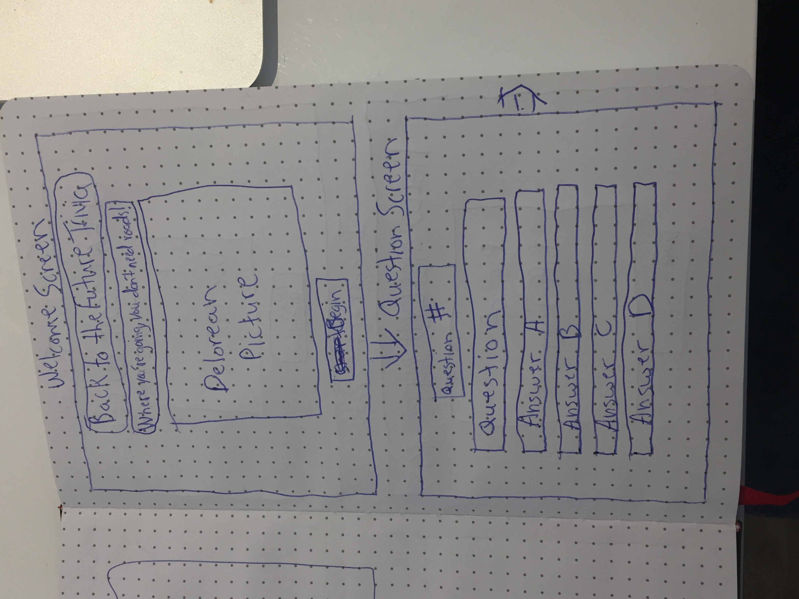

*** Jake Meltzer / 7/11/2017 ***

# Back to the Future Trivia Proposal

## What is Back to the Future Trivia?

The title is fairly self-explanatory: create a trivia game consisting of 20 multiple choice questions of varying difficulty from all three films in the Back to the Future trilogy. I'm choosing to make it because I am a massive movie geek, I love these films, and since my GA WDI cohort is called 'DeLorean,' I wanted to pay tribute by creating a game that combined my passion for film with this course.
## Wireframe

(Your wireframes go here. Preferably two or more)

## Initial thoughts on game structure

(Write out what challenges you expect to encounter, or ideas you want to come up with)

The key element of logic I need to figure to make the majority of make game run smoothly is after a player answers a question, make the screen change to the next screen with the next question. Depending on whether a player answers a questions correctly or not, I want to have an interlude screen with either "Great Scott, That's Right!" and a picture of enthusiastic Doc Brown when you choose a correct answer, or "HELLO MCFLY??? YOU'RE WRONG!" with a particularly mean picture of Biff Tannen when you answer incorrectly and the correct answer underneath.

Another challenge I expect to face is counting correct and incorrect answers and submitting an output after a players answers all 20 questions. This output would appear on a screen after you answer every question. I also want to make it so that if a player answers, for example, between 17 and 20 questions right, a picture of a character will come up with an encouraging comment. I want to set the tiers for every 4 questions, so if you answer 0-4 questions right, 5-8, 9-12, 13-16, and 17-20, a different screen will pop up with different picture and text. 

I also am scared of figuring out how to start the game over again. I struggled mightily with that in tic-tac-toe, so I have to figure out how to do that here.

## Phases of Completion

(The steps or phases you expect to go through, and the tasks that you'll need to accomplish to reach each step. These should resemble the acceptance criteria we were working through earlier.)

## Links and Resources

(Anything you've looked up so far or are thinking about using.)
